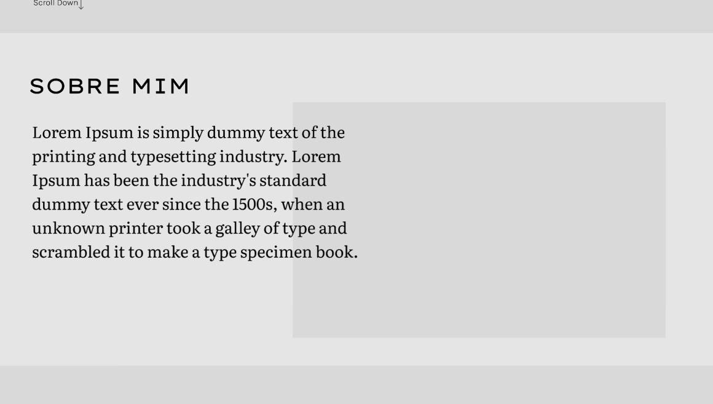
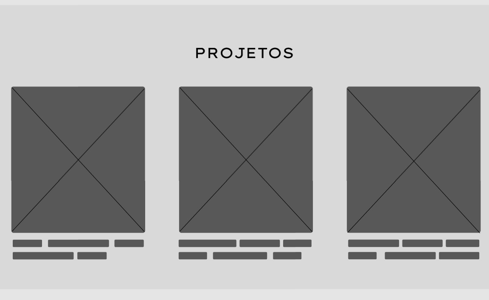
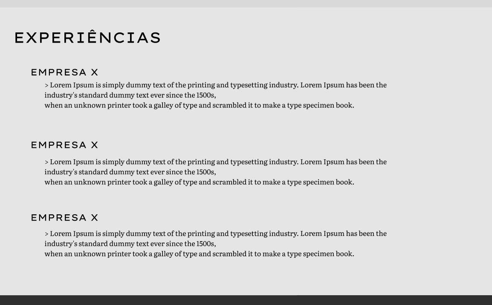
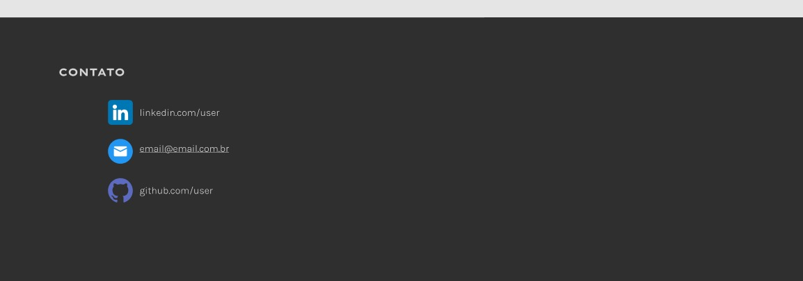
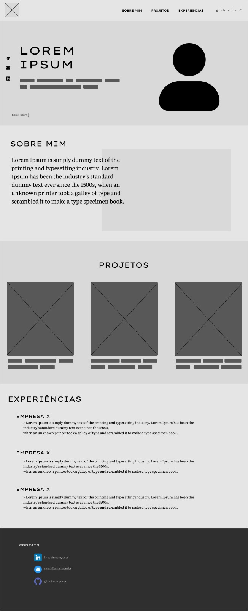

# Portfólio - Projeto de Software Lab 1

# Integrantes do Projeto
- Djair Augusto Galdino Soares
- Guilherme de Almeida Santos
- Guilherme Henrique Siqueira de Lana
- Pedro Rodrigues Duarte
## Descrição do Projeto
Este projeto é uma **Single Page Application (SPA)** desenvolvida para apresentar um portfólio profissional, integrando um back-end em **Node.js** para gerenciamento de dados.  
O site reúne informações sobre experiências e projetos realizados, além de oferecer um canal de contato direto.  

Este projeto está sendo desenvolvido **em grupo** como parte da disciplina **Projeto de Software**, referente ao **4º período** do curso **Engenharia de Software**, **turno noturno**.

---

## Tecnologias Usadas

### Front-end
-  **HTML5** – Estrutura semântica do conteúdo  
-  **CSS** – Estilização moderna e responsiva  
-  **JavaScript** – Interatividade e lógica da aplicação  
-  **React.js** – Framework para construção da SPA  
-  **Vite** – Build rápido e otimizado  

### Back-end
-  **Node.js** – Ambiente de execução do JavaScript no servidor  

---

## Imagens do Protótipo

### Sobre Mim
  
Seção que apresenta um breve resumo profissional, habilidades técnicas e informações pessoais de forma clara e objetiva.

### Projetos
  
Listagem dos principais trabalhos realizados, com imagens, descrições e links para visualização.

### Experiências
  
Histórico profissional e acadêmico, destacando funções, responsabilidades e conquistas.

### Contato
  
Área dedicada exclusivamente a botões de acesso rápido para.

### Wire completa
 

---

## Estrutura Atual do Projeto
```plaintext
📦 Projeto-portifolio
├── src
│   ├── back
│   │   ├── README.md
│   │   └── ...código do back-end (Node.js)
│   └── front
│       ├── README.md
│       └── ...código do front-end (Vite)
├── assets
│   └── ...imagens do protótipo
├── docs
│   └── readme.md
└── README.md
```

O front-end agora utiliza Vite e está localizado em `src/front`. O back-end está em `src/back`.
